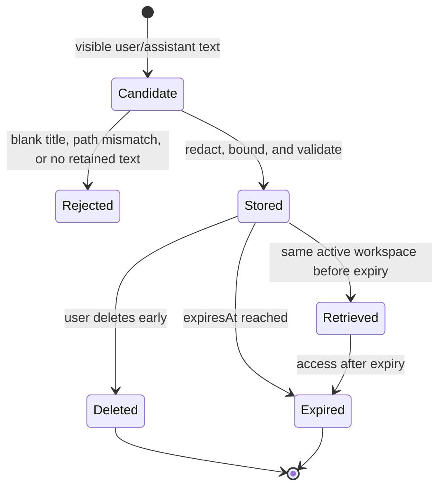

# Data Model: Custom Compaction Payload

## Workspace Identity

| Field | Type | Rules |
| --- | --- | --- |
| `canonicalPath` | string | Required. Canonical file-system path of the active VS Code workspace folder. The provider derives it and rejects mismatched UI input. |
| `storageKey` | string | Provider-generated workspace-state key; never supplied by the webview. |

A payload has exactly one workspace identity. Records are never queried across workspace keys.

## Visible Conversation Message

| Field | Type | Rules |
| --- | --- | --- |
| `role` | `'user' | 'assistant'` | Required positive allowlist. All other roles are rejected. |
| `text` | string | Required visible text after normalization and secret redaction. Empty post-redaction text is omitted. |
| `capturedAt` | ISO 8601 string | Optional display ordering evidence; input order remains authoritative. |

This is an input-only model. System prompts, tool calls/results, hidden reasoning, attachments, credentials, and secret values are not fields and must not be retained.

## Custom Compaction Payload

| Field | Type | Rules |
| --- | --- | --- |
| `id` | string | Provider-generated opaque identifier unique within the workspace store. |
| `title` | string | Required canonical user input; trimmed and non-empty. |
| `workspace` | Workspace Identity | Required; bound to the active workspace. |
| `messages` | Visible Conversation Message[] | Chronological order; newest retained whole messages only; maximum 100. |
| `textBytes` | integer | UTF-8 byte count of retained redacted message text; maximum 65,536. |
| `truncated` | boolean | True when a message or byte bound omitted older eligible text. |
| `truncationReason` | `'none' | 'message-limit' | 'byte-limit' | 'both'` | Explains `truncated`. |
| `createdAt` | ISO 8601 string | Provider clock at successful creation. |
| `expiresAt` | ISO 8601 string | Exactly 30 days after `createdAt`. |

## Lifecycle

## Validation Rules

1. The provider requires non-empty title and exact canonical active-workspace path match.
2. The provider accepts only `user` and `assistant` roles and their visible string text.
3. Redaction precedes byte counting, truncation, and persistence.
4. Selection is newest-first under both bounds, with no partial message; returned messages are chronological.
5. Create, list, and get purge expired records before returning a result.
6. Get and delete operate only on the active workspace's store. A foreign identifier is reported as unavailable, without revealing whether it exists elsewhere.
