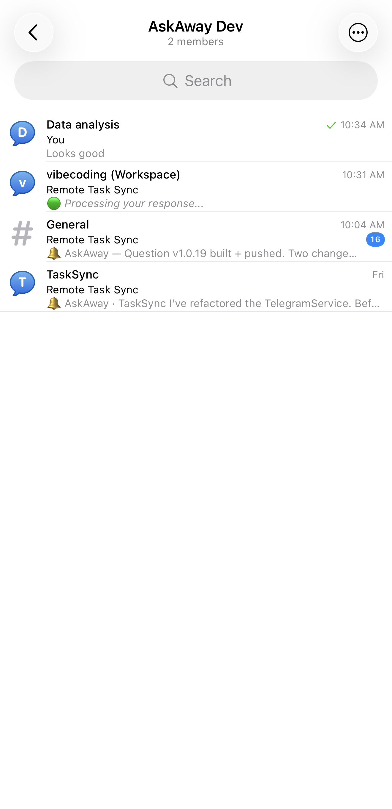
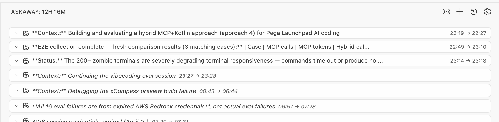

# AskAway

> **Based on [TaskSync v2.0.14](https://github.com/4regab/TaskSync)** — fully synced with upstream as of July 2025.

> [!WARNING]  
> **CONFLICT WARNING**: This extension (`AskAway`) uses the tool name `ask_user`. It conflicts with the `TaskSync` extension which uses the same tool name. **Disable one before using the other.**

**Keep AI agents in check. Get notified on Telegram. Reply from anywhere.**

AskAway bridges your AI coding agent (Copilot, Cursor, etc.) and your phone via Telegram — so you can monitor tasks, get asked questions, and send replies without being at your desk. Built on [TaskSync](https://github.com/4regab/TaskSync) by [intuitiv](https://github.com/intuitiv).

---

## 📸 In Action

### Telegram Integration — Forum Topics per Workspace

> _Each VS Code workspace gets its own Telegram topic. Questions and replies are neatly organized._

<!-- Screenshot placeholder: replace with your Telegram screenshot -->


### VS Code Widget — Tool Call History with Timestamps

> _Every ask/reply pair shows the time asked and time answered, right in the VS Code sidebar._

<!-- Screenshot placeholder: replace with your VS Code widget screenshot -->


---

## What's Different from TaskSync?

| Feature | TaskSync | AskAway |
|---------|----------|---------|
| Smart Queue / Normal / Autopilot modes | ✅ | ✅ |
| File & Folder References (#mentions) | ✅ | ✅ |
| Image Support (paste/drag-drop) | ✅ | ✅ |
| Tool Call History & Settings Modal | ✅ | ✅ |
| Reusable Prompts (/slash commands) | ✅ | ✅ |
| Interactive Approvals | ✅ | ✅ |
| MCP Server Integration | ✅ | ✅ |
| Remote Mobile & Web Access (QR code) | ❌ | ✅ |
| Webex Messaging Integration | ❌ | ✅ |
| **Telegram Bot Integration** | ❌ | ✅ |
| **Telegram Forum Topics per Workspace** | ❌ | ✅ |
| **Concurrent ask_user queuing** | ❌ | ✅ |
| **Timestamps on tool call cards** | ❌ | ✅ |

---

## 🤖 Telegram Integration

Receive AI agent questions on Telegram and reply from your phone — no need to be at your desk.

### Setup

1. Create a Telegram bot via [@BotFather](https://t.me/BotFather) → get your bot token
2. In VS Code Settings, set:
   - `askaway.telegram.enabled`: `true`
   - `askaway.telegram.botToken`: your bot token
   - `askaway.telegram.chatId`: your chat ID (use `AskAway: Get Telegram Chat ID` command to find it)

### Forum Topics (Recommended)

For team setups or multi-project workflows, use a **Telegram Group with Topics enabled**:

1. Create a Telegram group → Settings → Enable Topics
2. Add your bot as admin
3. Set `askaway.telegram.chatId` to the group's ID (negative number, e.g. `-1003849960079`)
4. AskAway automatically creates one topic per workspace — messages are organized by project

**How topics are managed:**
- On first message: fetches existing topics from Telegram (no duplicates across restarts)
- Creates a new topic automatically if none exists for the current workspace
- Workspace name becomes the topic name (`vscode.workspace.name` → first folder name → `'AskAway'`)

### Backward Compatibility

Users with the old direct-message bot setup (no group/topics) continue to work exactly as before — messages go to the DM chat without any topic routing.

---

## 📱 Remote Mobile & Web Access

Control AskAway from your phone, tablet, or any browser on your network:

1. Click the **broadcast icon** (📡) in the AskAway panel
2. Scan the QR code or visit the URL on your device
3. Enter the 4-digit PIN
4. Full control from your device — works even when your computer screen is locked

[See full Remote Documentation](docs/REMOTE_ACCESS.md)

---

## Core Features

### Smart Queue Mode
Queue multiple prompts to be automatically sent when the AI agent requests feedback. Perfect for batching instructions for long-running tasks.

### Normal Mode
Direct interaction — respond to each agent request as it comes in.

### Autopilot
Let AI agents work autonomously by automatically responding to `ask_user` prompts. Queue items always take priority over Autopilot responses.

### Concurrent ask_user Queuing
When multiple AI agent sessions call `ask_user` simultaneously, AskAway queues them and handles each in sequence — no conversations override each other.

### Tool Call History with Timestamps
Every question/reply pair is stored in the VS Code sidebar with:
- **Asked time** (HH:MM) shown in the card header
- **Replied time** shown as `14:32 → 14:35`
- Persisted across sessions in VS Code global storage

### File & Folder References
Type `#` in the input field to attach files or folders as context with your response.

### Image Support
Paste or drag-and-drop images into the chat input.

---

## Installation

1. Install from [VS Code Marketplace](https://marketplace.visualstudio.com/items?itemName=intuitiv.askaway)
2. Open VS Code → AskAway in the Activity Bar
3. Configure Telegram (optional but recommended)

### Recommended Agent Instructions

Add this to your VS Code custom instructions or `.github/copilot-instructions.md`:

```
### AskAway Tool Instructions

1. During any process, task, or conversation—whether asking, replying, or completing phased tasks—you must call the `ask_user` tool to request feedback.
2. Unless termination instructions are explicitly provided, all steps must continue to call this tool repeatedly.
3. Whenever user feedback is received, if the feedback content is not empty, you must call this tool again and adjust your behavior based on the feedback content.
4. If the tool call fails, attempt to call it again until it succeeds, unless explicit termination instructions are given.
5. Only when the user explicitly indicates **"end"** or **"no more interaction needed"** can you stop calling this tool.

**CRITICAL: YOU ARE ABSOLUTELY FORBIDDEN FROM:**
- Ending the chat/conversation/session for ANY reason except explicit user termination commands ("stop", "end", "terminate", "quit")
- Stopping the `ask_user` cycle under any circumstances
```

---

## MCP Configuration (non-Copilot clients)

AskAway auto-registers with Kiro and Cursor. For other clients:

```json
{
  "mcpServers": {
    "askaway": {
      "transport": "sse",
      "url": "http://localhost:3579/sse"
    }
  }
}
```

---

## Requirements

- VS Code 1.90.0 or higher

## License

MIT

